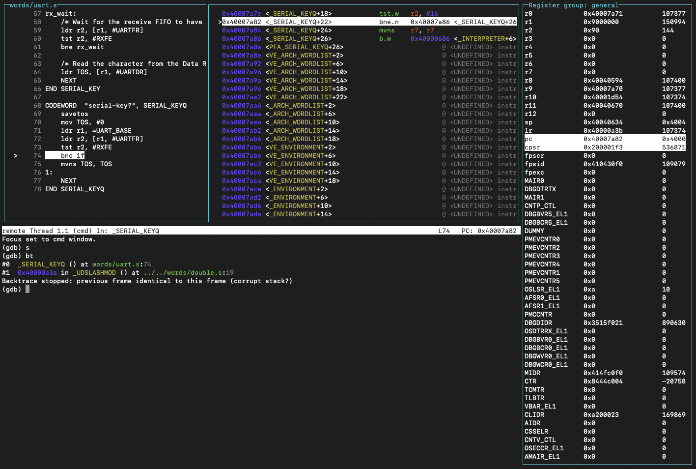
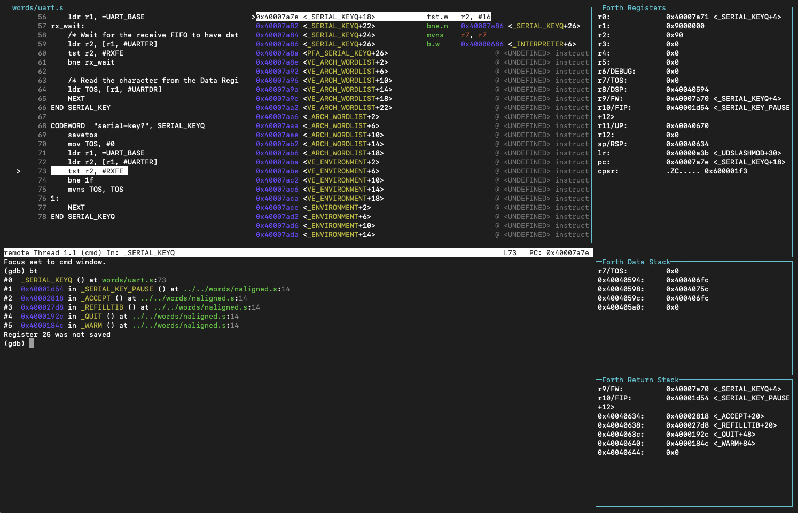

GDB should be primarily used for debugging CODEWORDs or in situations where AmForth is generally not responsive (e.g. boot time and initialization issues). AmForth runtime is a completely alien environment for GDB, that is why AmForth development tooling provides GDB extensions to give better insight into the state of AmForth virtual machine. The Makefiles normally provide `make gdb` command that starts the maximally extended GDB connected to the current target (more on that below). The extensions are implemented equally for both CPU architectures.

To debug AmForth GDB must connect to it through a "GDB server" process. This is somewhat different between [emulated](#qemu-targets) and [physical](#physical-targets) targets as discussed below.

GDB is normally part of the GNU toolchain. There are two variants of GDB and two fundamental ways of extending it.

Basic GDB allows adding custom commands implemented in terms of pre-existing GDB commands. AmForth dev tooling uses `.gdb` files for extending basic GDB this way. The main extension file is `amforth.gdb` and is specific to each CPU architecture, so there is `arm/dev/amforth.gdb` and `rv/dev/amforth.gdb`. The shared commands are in `core/dev/amforth-core.gdb` and are included automatically in the former files. These extensions provide commands to dump the parameter (`.s`) or return (`.r`) stack, commands to inspect dictionary words (`.lfa`, `.ffa`, `.nfa`, `.cfa`, ...), and debugging helpers for setting breakpoints etc. See the file comments for more details.

Another category of extensions is the GDB TUI (text UI). It allows creating a more informative interface layout that shows more information at a glance. The layout is composed of predefined "windows". File `core/dev/tui-basic.gdb` provides such layout using the basic predefined windows. It includes a view of all  CPU registers, view of the disassembled code being executed, and the original source of that code (when possible, see [Code source](#code-source) below).

# GDBPY

A separate GDB executable (usually with a `py` suffix) extends the basic GDB with a Python API that allows much more extensive customization. This one may take a bit of fiddling to get going because it relies on Python3 being installed on the host OS as a shared library. It is fussy about specific version being available, etc. You may need to pay close attention to the error messages to resolve these issues if it fails to start.

It is however worth it, if you can get it going, because the extensions are much more powerful when using GDBPY. In general you get a much more capable TUI with an additional window for the AmForth data stack and return stack. It also extends the register window to highlight which registers are dedicated for the Forth runtime and renders their value in most suitable way. Moreover a custom ForthUnwinder allows GDB to properly reconstruct the AmForth backtrace, so the core GDB `bt` command becomes actually usable.

These extensions are brought in by the `core/dev/tui-full.gdb` file. This is what is used by the `make gdb` command by default. If you cannot get GDBPY to work correctly then change it to use the `tui-basic.gdb` and basic GDB instead.

# Code source

Both TUI versions employ a source window that tries to map the executed instructions to the original source code that produced it. For this `amforth.elf` must be compiled with debug information, which it is by default (assembler -g option). However the GNU assembler only produces debug info for actual assembler code. This means that you will see correct source when debugging a CODEWORD, but a completely incorrect source when stepping through a COLON word.

The only way to correct this situation is to instrument the build process to generate detailed debug information for all files in some other way. This has not been done (yet), partly because it cannot be done only partially. As soon as the assembler sees any explicit debug information in the sources it is compiling, it stops automatically generating any debug info at all. So we either have to explicitly instrument everything, or nothing at all; therefore it's the latter at the moment.

Moreover all the pre-compiled AmForth words are marked as proper function blocks for debug_info purposes. This however proved to be insufficient to resolve the source mapping issues.

# QEMU targets

Emulated targets can rely on QEMU's built in GDB server for GDB connection. All that's needed is starting QEMU with the `-s` option. The `make debug` command does exactly that. The GDB server runs with the default TCP port 1234. This is where `make gdb` will try to connect to for these targets.

If you need to debug AmForth's early boot sequence, it is often useful to add the `-S` option that will instruct QEMU to start AmForth in a halted state, this way it will wait for GDB to connect and you will have full control over what happens next.

# Physical targets

Physical targets require an external GDB server that is capable of relaying GDB commands to the MCU through MCU's debugging instrumentation. This is what `OpenOCD` does. As you can imagine this is a fairly complex and highly MCU specific setup. Consequently MCUs often require a customized version of OpenOCD, often provided by the MCU vendor. This makes it difficult to provide universal instructions on how to install OpenOCD, you will need to find instructions specific to the MCU you are interested in. The MCU readme may have additional information on this. Sometimes it may be easiest to install a development environment recommended for the board in question (e.g. Arduino IDE) and find the OpenOCD installation there. You should be able to easily hook the AmForth make commands to that installation through the `OPENOCD` make variable.

Once you have OpenOCD installed, `make ocd` command is set up to start and connect OpenOCD to the specific MCU target. When you have OpenOCD running, the `make gdb` command will start and connect GDB to it. You will commonly need separate terminal windows to control all these components. That includes another terminal to run `amforth-shell.py` to interact with AmForth itself.

